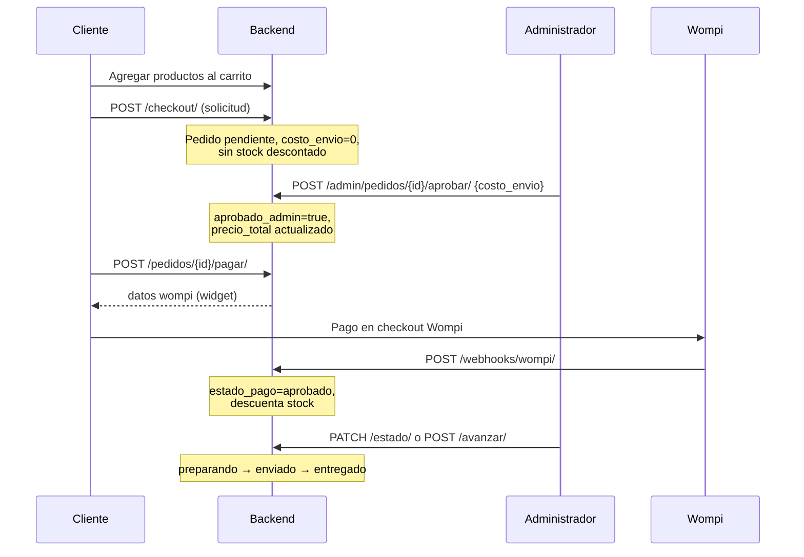
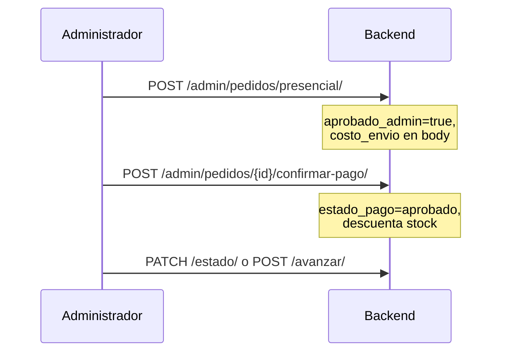

# Documentación API — Módulo Ventas (SIGIBARF)

**Versión del documento:** alineada con el código en `apps/ventas` (junio 2026).  
**Prefijo de rutas esperado:** `/api/ventas/` (ver [§1.1](#11-montaje-de-urls-importante)).

---

## Tabla de contenidos

1. [Introducción y autenticación](#1-introducción-y-autenticación)
2. [Modelo de datos](#2-modelo-de-datos)
3. [Flujos de negocio](#3-flujos-de-negocio)
4. [Endpoints — Cliente](#4-endpoints--cliente)
5. [Endpoints — Administrador](#5-endpoints--administrador)
6. [Webhook Wompi](#6-webhook-wompi)
7. [Integración Wompi](#7-integración-wompi)
8. [Inventario y stock](#8-inventario-y-stock)
9. [Variables de entorno](#9-variables-de-entorno)
10. [Errores comunes](#10-errores-comunes)
11. [Qué falta / limitaciones](#11-qué-falta--limitaciones)
12. [Checklist pre-producción](#12-checklist-pre-producción)

---

## 1. Introducción y autenticación

### 1.1 Montaje de URLs (importante)

Las rutas están definidas en `apps/ventas/urls.py`, pero **`project/urls.py` no incluye ventas**:

```python
# Falta agregar:
path("api/ventas/", include("apps.ventas.urls")),
```

Hasta montar esa línea, **ningún endpoint de ventas es accesible** en HTTP.

### 1.2 Autenticación

| Tipo | Header | Uso |
|------|--------|-----|
| JWT | `Authorization: Bearer <access_token>` | Casi todos los endpoints |
| Ninguno | — | Solo webhook Wompi (validado por firma) |

Tokens emitidos por `apps.usuarios` (SimpleJWT).

### 1.3 Permisos por rol

| Permiso | Quién |
|---------|--------|
| `IsAuthenticated` | Cualquier usuario autenticado (cliente o admin) |
| `IsAdministrador` | Rol `Administrador` o `is_staff` / `is_superuser` |
| `WompiWebhookPermission` | Público; opcional filtro por IP |

El default global de DRF es `IsAdministrador`, pero **cada vista de ventas sobreescribe** sus permisos.

### 1.4 Paginación

Listados de pedidos (`mis-pedidos`, `admin/pedidos`) devuelven:

```json
{
  "count": 42,
  "next": "http://...?page=2",
  "previous": null,
  "results": [ ... ]
}
```

| Query param | Default | Máximo |
|-------------|---------|--------|
| `page` | 1 | — |
| `page_size` | 20 | 100 |

---

## 2. Modelo de datos

### 2.1 CarritoCompra (`carrito_compras`)

Un carrito por usuario (`OneToOne`).

| Campo | Tipo | Descripción |
|-------|------|-------------|
| `usuario` | FK Usuario | Dueño del carrito |
| `estado` | string | `activo`, `checkout`, `completado`, `abandonado` (default: `activo`) |
| `fecha_creacion` / `fecha_actualizacion` | datetime | Automáticos |

### 2.2 ProductoCarrito (`producto_carrito`)

Líneas del carrito. Un producto no se repite por carrito (constraint único).

### 2.3 Pedido (`pedido`)

| Campo | Descripción |
|-------|-------------|
| `usuario` | Cliente (nullable en walk-in presencial) |
| `tipo_pago` | `tarjeta`, `transferencia`, `billetera_digital`, `efectivo`, `credito` |
| `cliente_presencial` | `true` solo en mostrador (admin) |
| `direccion_envio` | Texto; obligatorio en checkout online |
| `coordenadas_lat` / `coordenadas_lng` | Opcionales |
| `estado_pedido` | Ciclo logístico (lo gestiona el **admin**) |
| `estado_pago` | Ciclo financiero (Wompi o **admin** presencial) |
| `costo_envio` | Lo define el **admin** (online al aprobar; presencial al crear) |
| `precio_total` | Subtotal productos + `costo_envio` |
| `aprobado_admin` | `true` cuando el admin revisó y definió envío (online) o creó presencial |
| `referencia_wompi` | Referencia única `PEDIDO-{id}-{uuid}` para Wompi |
| `id_transaccion_wompi` | ID de transacción en Wompi |
| `fecha_pago` | Timestamp al aprobar pago |

**Constraints BD:**

- `efectivo` / `credito` ⇒ `cliente_presencial = true`
- `precio_total > 0`, `costo_envio >= 0`

### 2.4 Estados

**`estado_pedido`** (administrador):

```
pendiente → confirmado → preparando → enviado → entregado
                    ↘ cancelado
```

**`estado_pago`**:

| Valor | Origen típico |
|-------|----------------|
| `pendiente` | Pedido creado / esperando pago |
| `aprobado` | Webhook Wompi o `confirmar-pago` admin |
| `rechazado` | Webhook Wompi rechazado o cancelación admin |

### 2.5 PedidoProducto (`pedido_producto`)

Snapshot de precio al crear el pedido (`precio_unitario`, `subtotal`, `cantidad`).

---

## 3. Flujos de negocio

### 3.1 Pedido online (cliente web)



**Responsabilidades:**

| Qué | Quién |
|-----|--------|
| `costo_envio` | Administrador (`/aprobar/`) |
| `estado_pedido` | Administrador |
| `estado_pago` | Wompi (webhook) |
| Stock | Se descuenta al **aprobarse el pago** (no al checkout ni al aprobar envío) |

### 3.2 Pedido presencial (mostrador)



- Solo `efectivo` o `credito` como `tipo_pago`.
- **Crédito:** puede avanzar `estado_pedido` sin `estado_pago=aprobado` (preparado para futura app `creditos`, aún no integrada).

### 3.3 Carrito — limpieza automática

No hay endpoint de “abandonar carrito” en la API.

Al llamar `GET /carrito/` (u operaciones que usan `obtener_o_crear_carrito`), se ejecuta `limpiar_carritos_expirados()`:

- Carritos en `checkout` o `abandonado` con `fecha_actualizacion` mayor a **30 min** (configurable) se vacían y pasan a `activo`.

---

## 4. Endpoints — Cliente

Base: `/api/ventas/`  
Auth: **Bearer JWT** (usuario autenticado).

---

### 4.1 `GET /carrito/`

**Función:** Obtiene el carrito del usuario o lo crea en estado `activo`. Ejecuta limpieza de carritos expirados.

**Body:** ninguno.

**Respuesta `200`:**

```json
{
  "id": 1,
  "usuario": 5,
  "estado": "activo",
  "fecha_creacion": "2026-06-01T12:00:00Z",
  "fecha_actualizacion": "2026-06-01T12:00:00Z",
  "productos": [
    {
      "id": 10,
      "producto_nombre": "Brownie",
      "producto_precio": "15000.00",
      "cantidad": 2,
      "fecha_agregado": "..."
    }
  ],
  "subtotal_carrito": 30000
}
```

**Errores:** `401` sin token.

---

### 4.2 `POST /carrito/productos/`

**Función:** Agrega un producto al carrito (suma cantidades si ya existe).

**Body (JSON):**

| Campo | Tipo | Obligatorio | Descripción |
|-------|------|-------------|-------------|
| `producto_id` | integer | **Sí** | ID de `inventario.Producto` (no inhabilitado) |
| `cantidad` | integer | **Sí** | Mínimo 1; valida stock disponible |

**Ejemplo:**

```json
{
  "producto_id": 3,
  "cantidad": 2
}
```

**Respuesta `201`:** objeto `ProductoCarrito` (igual estructura que en lista del carrito).

**Errores `400`:**

- Stock insuficiente
- Producto no encontrado / inhabilitado
- Cantidad &lt; 1

---

### 4.3 `PATCH /carrito/productos/{producto_id}/`

**Función:** Reemplaza la cantidad de un producto en el carrito **activo**.

**Body:**

| Campo | Tipo | Obligatorio |
|-------|------|-------------|
| `cantidad` | integer | **Sí** (mínimo 1) |

**Respuesta `200`:** línea actualizada.

**Errores `400`:** producto no en carrito activo, stock insuficiente, `cantidad` no entera.

---

### 4.4 `DELETE /carrito/productos/{producto_id}/`

**Función:** Elimina una línea del carrito activo.

**Body:** ninguno.

**Respuesta `204`:** sin cuerpo.

**Errores `400`:** producto no estaba en el carrito.

---

### 4.5 `POST /checkout/`

**Función:** Convierte el carrito activo en un **pedido solicitud** (online). No cobra, no llama Wompi, no descuenta stock.

**Body (JSON):**

| Campo | Tipo | Obligatorio | Descripción |
|-------|------|-------------|-------------|
| `tipo_pago` | string | **Sí** | Solo: `tarjeta`, `transferencia`, `billetera_digital` |
| `direccion_envio` | string | **Sí** | No puede ser solo espacios |
| `coordenadas_lat` | float | No | Entre -90 y 90 |
| `coordenadas_lng` | float | No | Entre -180 y 180 |

**No acepta:** `costo_envio` (siempre 0 al crear; lo pone el admin después).

**Ejemplo:**

```json
{
  "tipo_pago": "tarjeta",
  "direccion_envio": "Calle 10 #20-30, Cúcuta",
  "coordenadas_lat": 7.8939,
  "coordenadas_lng": -72.5078
}
```

**Respuesta `201`:**

```json
{
  "id": 15,
  "tipo_pago": "tarjeta",
  "estado_pedido": "pendiente",
  "estado_pago": "pendiente",
  "costo_envio": "0.00",
  "subtotal_productos": "30000.00",
  "precio_total": "30000.00",
  "aprobado_admin": false,
  "listo_para_pago": false,
  "productos": [ ... ],
  "mensaje": "Pedido registrado. Un administrador revisará su solicitud y definirá el costo de envío antes de habilitar el pago."
}
```

**Efectos internos:**

- Carrito → `completado`
- Pedido: `aprobado_admin=false`, `costo_envio=0`
- Stock: **sin cambio**

**Errores `400`:**

- Carrito vacío o inactivo
- Stock insuficiente en alguna línea
- `tipo_pago` efectivo/crédito
- Dirección vacía

---

### 4.6 `POST /pedidos/{pedido_id}/pagar/`

**Función:** Devuelve datos para iniciar el **Widget / Checkout Web de Wompi** después de que el admin aprobó el pedido.

**Body:** ninguno (vacío `{}` válido).

**Precondiciones:**

- Pedido pertenece al usuario autenticado
- `aprobado_admin = true`
- `estado_pago = pendiente`
- No cancelado
- No presencial

**Respuesta `200`:**

```json
{
  "wompi": {
    "public_key": "pub_test_...",
    "currency": "COP",
    "amount_in_cents": 3500000,
    "reference": "PEDIDO-15-a1b2c3d4e5f6...",
    "integrity": "sha256hex..."
  }
}
```

**Errores `400`:**

- Pedido no aprobado por admin
- Ya pagado / cancelado
- Pedido presencial

---

### 4.7 `GET /mis-pedidos/`

**Función:** Historial paginado del usuario. **Excluye** pedidos con `estado_pedido=cancelado`.

**Query params:**

| Param | Obligatorio | Descripción |
|-------|-------------|-------------|
| `page` | No | Página |
| `page_size` | No | Tamaño (máx. 100) |

**Respuesta `200`:** paginación + `results[]` con `PedidoSerializer` (incluye `listo_para_pago`, `subtotal_productos`).

**No incluye:** `usuario_id` / email (solo lectura propia).

---

## 5. Endpoints — Administrador

Base: `/api/ventas/admin/...`  
Auth: **Bearer JWT** con rol **Administrador**.

---

### 5.1 `GET /admin/pedidos/`

**Función:** Lista todos los pedidos (incluidos cancelados) con datos del cliente.

**Query params:**

| Param | Obligatorio | Descripción |
|-------|-------------|-------------|
| `usuario_id` | No | Filtra por cliente |
| `page`, `page_size` | No | Paginación |

**Respuesta `200`:** paginado con `PedidoAdminReadSerializer`:

Campos extra vs cliente: `usuario_id`, `usuario_email` (campo `correo` del modelo Usuario).

---

### 5.2 `POST /admin/pedidos/presencial/`

**Función:** Crea pedido en mostrador (efectivo o crédito).

**Body (JSON):**

| Campo | Tipo | Obligatorio | Default | Descripción |
|-------|------|-------------|---------|-------------|
| `items` | array | **Sí** | — | Al menos un producto |
| `items[].producto_id` | int | **Sí** | — | Producto habilitado |
| `items[].cantidad` | int | **Sí** | — | ≥ 1, valida stock |
| `tipo_pago` | string | **Sí** | — | Solo `efectivo` o `credito` |
| `usuario` | int | No | `null` | FK usuario (walk-in anónimo si omitido) |
| `direccion_envio` | string | No | `""` | |
| `coordenadas_lat` | float | No | `null` | |
| `coordenadas_lng` | float | No | `null` | |
| `costo_envio` | decimal | No | `0.00` | Admin lo define en mostrador |

**Ejemplo:**

```json
{
  "usuario": 5,
  "tipo_pago": "efectivo",
  "costo_envio": "5000.00",
  "items": [
    { "producto_id": 1, "cantidad": 2 }
  ]
}
```

**Respuesta `201`:** pedido con `aprobado_admin=true`, `cliente_presencial=true`, stock **aún sin descontar**.

---

### 5.3 `POST /admin/pedidos/{pedido_id}/aprobar/`

**Función:** Revisa pedido **online**, asigna **costo de envío** y habilita el pago (`aprobado_admin=true`). Recalcula `precio_total`.

**Body (JSON):**

| Campo | Tipo | Obligatorio |
|-------|------|-------------|
| `costo_envio` | decimal | **Sí** (≥ 0) |

**Ejemplo:**

```json
{ "costo_envio": "8000.00" }
```

**Respuesta `200`:** pedido actualizado (`PedidoAdminReadSerializer`).

**Errores `400`:**

- Pedido presencial (usa costo al crear)
- Ya aprobado
- Cancelado

**No cambia:** `estado_pedido` (sigue en manos del admin vía `/estado/` o `/avanzar/`).

---

### 5.4 `POST /admin/pedidos/{pedido_id}/cancelar/`

**Función:** Rechaza solicitud **antes de pago aprobado**. Marca `estado_pedido=cancelado` y `estado_pago=rechazado` si estaba pendiente.

**Body:** ninguno.

**No restituye stock** (nunca se descontó si no hubo pago).

**Errores `400`:** ya cancelado, o pago ya `aprobado`.

---

### 5.5 `PATCH /admin/pedidos/{pedido_id}/estado/`

**Función:** El administrador fija **`estado_pedido`** explícitamente.

**Body (JSON):**

| Campo | Tipo | Obligatorio | Valores |
|-------|------|-------------|---------|
| `estado_pedido` | string | **Sí** | `pendiente`, `confirmado`, `preparando`, `enviado`, `entregado` |

**No usar** `cancelado` aquí (usar `/cancelar/`).

**Reglas:**

- No modificar pedidos `cancelado` o `entregado`
- Para pasar a `preparando`, `enviado` o `entregado`: exige `estado_pago=aprobado` (excepto `tipo_pago=credito`)

**Respuesta `200`:** pedido actualizado.

---

### 5.6 `POST /admin/pedidos/{pedido_id}/avanzar/`

**Función:** Avanza **un paso** en la cadena lineal:

```
pendiente → confirmado → preparando → enviado → entregado
```

**Body:** ninguno.

**Reglas adicionales:**

- Requiere `estado_pago=aprobado` (excepto crédito)
- Mismas validaciones de pago para estados de fulfillment que en `PATCH /estado/`

**Errores `400`:** estado final alcanzado, sin pago, cancelado.

---

### 5.7 `POST /admin/pedidos/{pedido_id}/confirmar-pago/`

**Función:** Confirma cobro **presencial** (efectivo). Marca `estado_pago=aprobado` y **descuenta stock**.

**Body:** ninguno.

**Solo:** `cliente_presencial=true`, `estado_pago=pendiente`, `aprobado_admin=true`.

**No modifica** `estado_pedido` (lo hace el admin aparte).

---

## 6. Webhook Wompi

### 6.1 `POST /webhooks/wompi/`

**Función:** Recibe eventos de Wompi (`transaction.updated`). Actualiza **solo `estado_pago`** (y stock al aprobar).

**Auth:** sin JWT. Firma obligatoria + rate limit `60/min` (configurable).

**Body:** JSON enviado por Wompi (estructura oficial). Ejemplo simplificado:

```json
{
  "event": "transaction.updated",
  "data": {
    "transaction": {
      "id": "uuid-transaccion",
      "status": "APPROVED",
      "reference": "PEDIDO-15-a1b2c3...",
      "amount_in_cents": 3500000
    }
  },
  "signature": {
    "properties": ["transaction.id", "transaction.status", "transaction.amount_in_cents"],
    "checksum": "..."
  },
  "timestamp": 1530291411
}
```

**Comportamiento:**

| `status` Wompi | Acción backend |
|----------------|----------------|
| `APPROVED` | `confirmar_pago_wompi` — valida monto, descuenta stock, `estado_pago=aprobado` |
| `DECLINED`, `VOIDED`, `ERROR` | `rechazar_pago_wompi` — `estado_pago=rechazado`, `estado_pedido=cancelado` |
| Otros | Ignorados, responde `200` |

**Respuestas:**

| Código | Cuándo |
|--------|--------|
| `200` | Procesado o ignorado (Wompi no reintenta) |
| `401` | Firma inválida |

**Seguridad:**

- Verificación SHA256 según [docs Wompi eventos](https://docs.wompi.co/docs/colombia/eventos/)
- Referencia debe coincidir con `pedido.referencia_wompi`
- Comparación de `amount_in_cents` vs `precio_total` del pedido
- IP allowlist opcional (`WOMPI_WEBHOOK_ALLOWED_IPS`)

---

## 7. Integración Wompi

### 7.1 ¿Funciona realmente?

| Pieza | Estado | Notas |
|-------|--------|-------|
| Firma de integridad (checkout) | ✅ Implementada | `SHA256(referencia + centavos + COP + INTEGRITY_KEY)` |
| Verificación webhook | ✅ Implementada | Propiedades dinámicas + timestamp + secret |
| Referencia única | ✅ | `PEDIDO-{id}-{uuid32}` |
| Validación de monto | ✅ | En webhook |
| Widget en frontend | ⚠️ **Parcial** | Backend solo devuelve 5 campos; el front debe integrar el widget |
| URL de eventos en dashboard Wompi | ❓ Manual | Debe apuntar a `https://<dominio>/api/ventas/webhooks/wompi/` |
| Montaje `/api/ventas/` | ❌ **Falta** | Ver §1.1 |
| `WOMPI_SANDBOX` en settings | ⚠️ No usado | No alterna URLs/keys automáticamente |
| Tokens de aceptación Wompi | ❌ No expuestos | El widget/API de Wompi suele requerir `acceptance_token` |
| `redirect_url` | ❌ No en respuesta | Recomendado para volver al front tras pagar |
| Consulta API transacción (doble check) | ❌ No implementada | Opcional según docs Wompi |
| Notificaciones al cliente | ❌ No | Email/push al aprobar envío o cobrar |

### 7.2 Flujo técnico en la app

```
1. Cliente → POST /checkout/           → pedido sin envío
2. Admin   → POST /aprobar/            → costo_envio + precio_total
3. Cliente → POST /pedidos/{id}/pagar/ → { wompi: { public_key, amount_in_cents, reference, integrity } }
4. Frontend abre Widget Wompi con esos datos (+ redirect_url, customer_email, etc.)
5. Wompi   → POST /webhooks/wompi/     → estado_pago + stock
```

El backend **no procesa tarjetas**; delega en Wompi. El `tipo_pago` del pedido es la **preferencia** del cliente; el método real lo elige Wompi en el widget.

### 7.3 Campos que el frontend debe usar con Wompi

Además de lo que devuelve la API, la [documentación del Widget](https://docs.wompi.co/docs/colombia/widget-checkout-web/) suele requerir:

- `customer_email`
- `redirect-url` (URL de retorno)
- Tokens de aceptación de políticas (`acceptance_token`)

**Estos no los genera hoy el backend** — el front debe obtenerlos (API pública Wompi) o ampliarse el endpoint `/pagar/`.

### 7.4 Referencia y reintentos de pago

- La referencia se genera en el **primer** `POST /pagar/` y se guarda en `referencia_wompi`.
- Reintentos usan la misma referencia (Wompi exige unicidad por transacción exitosa).
- Si el admin cambia `costo_envio` después de generar referencia, hay que **invalidar/regenerar** referencia (hoy no hay endpoint para eso — ver §11).

---

## 8. Inventario y stock

| Momento | ¿Descuenta stock? |
|---------|-------------------|
| Agregar al carrito | No |
| `POST /checkout/` | No |
| `POST /aprobar/` | No |
| `POST /pagar/` (solo datos Wompi) | No |
| Webhook `APPROVED` | **Sí** |
| `POST /confirmar-pago/` presencial | **Sí** |
| Webhook rechazado / cancelar antes de pago | No (no había salida) |

Dependencia: `apps.inventario.services.registrar_salida_producto` / `registrar_entrada_producto`.

**Carrera de stock:** validación optimista en carrito; el descuento final es atómico con `select_for_update` al pagar.

---

## 9. Variables de entorno

| Variable | Obligatoria | Default | Uso |
|----------|-------------|---------|-----|
| `WOMPI_PUBLIC_KEY` | Sí (prod) | — | Checkout widget |
| `WOMPI_INTEGRITY_KEY` | Sí (prod) | — | Firma integridad |
| `WOMPI_EVENTS_SECRET` | Sí (prod) | — | Firma webhook |
| `WOMPI_SANDBOX` | No | `True` | **No usado en código** |
| `WOMPI_WEBHOOK_ALLOWED_IPS` | No | vacío | Allowlist IP (vacío = desactivado) |
| `WOMPI_WEBHOOK_THROTTLE` | No | `60/min` | Rate limit webhook |
| `CARRITO_CHECKOUT_EXPIRACION_MINUTOS` | No | `30` | Limpieza carritos atascados |

---

## 10. Errores comunes

### HTTP

| Código | Situación |
|--------|-----------|
| `400` | Validación negocio (`{"detail": "..."}` o errores de serializer) |
| `401` | Sin token / token inválido |
| `403` | Usuario autenticado sin rol admin en rutas admin |
| `401` | Webhook firma inválida |
| `404` | Ruta no montada o pedido inexistente (DRF puede devolver 404 según configuración) |

### Mensajes frecuentes (`detail`)

| Mensaje | Causa |
|---------|--------|
| `No tienes un carrito activo` | Checkout sin carrito en estado `activo` |
| `El pedido aún no ha sido revisado...` | `POST /pagar/` antes de `/aprobar/` |
| `Stock insuficiente` | Cantidad &gt; `stock_actual` |
| `No se puede avanzar el estado sin pago aprobado` | Admin avanza fulfillment sin cobro |
| `El pedido ya fue revisado por un administrador` | Segundo `POST /aprobar/` |
| `Monto de la transacción ... no coincide` | Webhook con monto distinto al `precio_total` |
| `Firma inválida` | Webhook tampered o secret incorrecto |

### Errores operativos (sin mensaje al cliente)

- Webhook con referencia desconocida → log + `200` (evita reintentos infinitos)
- Webhook sin `amount_in_cents` en aprobación → log + `200`, no confirma pago
- Claves Wompi `None` → firma/checkout falla en runtime

---

## 11. Qué falta / limitaciones

### Bloqueantes

1. **Montar URLs** en `project/urls.py`.
2. **Migraciones** al día (`aprobado_admin`, `referencia_wompi`, `estado_pedido` default, etc.). Las migraciones en repo pueden estar desfasadas del modelo — ejecutar `makemigrations ventas`.
3. **Configurar webhook** en dashboard Wompi (HTTPS público).

### API / producto

| Falta | Impacto |
|-------|---------|
| `GET /pedidos/{id}/` detalle | Cliente/admin no tienen endpoint de detalle |
| Regenerar referencia Wompi si cambia `costo_envio` post-pago | Pago con monto incorrecto |
| Endpoint admin para **rechazar** con motivo / notificar cliente | Solo cancelar silencioso |
| Integración app **`creditos`** | `tipo_pago=credito` sin crear `Credito` |
| `WOMPI_SANDBOX` usado en código | Front debe cambiar keys manualmente |
| `acceptance_token`, `redirect_url`, `customer_email` en `/pagar/` | Integración widget incompleta desde backend |
| Notificaciones (email) al aprobar envío | Cliente no sabe que ya puede pagar |
| Reserva de stock entre checkout y pago | Dos clientes pueden pasar validación; solo el primero en pagar descuenta |
| Cancelar pedido **después** de pago con devolución automática | Solo mensaje “gestión manual” |
| Tests automatizados ventas/Wompi | Sin cobertura en repo |
| Django Admin registrado para modelos ventas | Gestión solo vía API |
| Filtros admin (`estado_pedido`, fechas) | Solo `usuario_id` |
| Actualizar `costo_envio` presencial antes de cobrar | Solo al crear |
| Idempotencia explícita webhook (log de `id_transaccion` procesado) | Reintentos fallan con error en log si ya aprobado |

### Seguridad / privacidad

- Listado admin expone direcciones y coordenadas sin paginación obligatoria en UI.
- Cualquier usuario autenticado puede hacer checkout (no solo rol `Cliente`).
- Logs de webhook no deben guardar PAN/datos sensibles (Wompi normalmente no los envía).

### Documentación externa

- Actualizar `ENDPOINTS.md` del repo (sigue diciendo que no hay API ventas).

---

## 12. Checklist pre-producción

- [ ] `path("api/ventas/", include("apps.ventas.urls"))` en `project/urls.py`
- [ ] `python manage.py migrate` con modelo actual
- [ ] Variables Wompi producción vs sandbox en `.env`
- [ ] URL webhook registrada en Wompi (mismo ambiente)
- [ ] Front: widget Wompi + `redirect_url` + manejo de `listo_para_pago`
- [ ] Front: flujo admin (lista pendientes → aprobar con envío)
- [ ] Probar E2E: checkout → aprobar → pagar → webhook → avanzar estados
- [ ] Probar presencial: crear → confirmar pago → avanzar
- [ ] Probar cancelación antes de pago
- [ ] Probar pago rechazado Wompi (pedido cancelado, sin stock descontado)
- [ ] HTTPS en producción para webhook

---

## Resumen de endpoints

| Método | Ruta | Rol | Descripción breve |
|--------|------|-----|-------------------|
| GET | `/carrito/` | Cliente | Ver/crear carrito |
| POST | `/carrito/productos/` | Cliente | Agregar producto |
| PATCH | `/carrito/productos/{id}/` | Cliente | Cambiar cantidad |
| DELETE | `/carrito/productos/{id}/` | Cliente | Quitar producto |
| POST | `/checkout/` | Cliente | Solicitar pedido online |
| POST | `/pedidos/{id}/pagar/` | Cliente | Datos Wompi |
| GET | `/mis-pedidos/` | Cliente | Historial paginado |
| POST | `/webhooks/wompi/` | Wompi | Eventos de pago |
| GET | `/admin/pedidos/` | Admin | Listar todos |
| POST | `/admin/pedidos/presencial/` | Admin | Pedido mostrador |
| POST | `/admin/pedidos/{id}/aprobar/` | Admin | Costo de envío (online) |
| POST | `/admin/pedidos/{id}/cancelar/` | Admin | Rechazar solicitud |
| PATCH | `/admin/pedidos/{id}/estado/` | Admin | Cambiar estado logístico |
| POST | `/admin/pedidos/{id}/confirmar-pago/` | Admin | Cobro presencial |
| POST | `/admin/pedidos/{id}/avanzar/` | Admin | Siguiente estado lineal |

---

*Documento generado para el equipo SIGIBARF. Para cambios de contrato API, actualizar este archivo junto con el código.*
